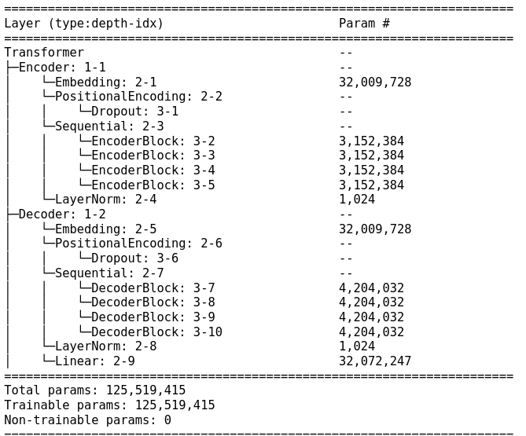

# character-classification

## Overview

The goal of this project was to develop my own translation app using deep learning. I trained my own transformer models for translation between English to and from German, Russian and French, using the original architecture from  
https://arxiv.org/abs/1706.03762

I incorporated the models in a web app, which can be tested here
https://willsutcliffe-translation-app-translator-x0wxy5.streamlit.app/

The app includes the possibility of using pre-trained models  Helsinki-NLP/opus-mt-X-Y from huggingface for more languages like Spanish, Chinese and Japanese.

The corresponding github repo is:
https://github.com/willsutcliffe/translation-app

An example of a notebook for training is found in Notebooks:
Transformer\_training.ipynb

The code for the transformer is found in translation/model and is based on the transformer implementation of the Udemy course covering Transformers by
the LazyProgrammer

## Motivation

The motivation for this project arose from the fact that I enjoy learning languages and therefore was keen to do a project combining natural language processing and deep learning. 

Personally, I have spent time learning German, Russian and French hence I chose to translate from these languages to English and vice versa.

## Data

I use around 2-4m sentence pairs depending on the language pair. I used sentence pairs from https://tatoeba.org/en/ and WMT machine translation conference pages such as https://www.statmt.org/wmt22/, which includes news.

I use around 1\% of the data for validation given the large datasets. All sentences were truncated at 60 words and hugging face data utilities were used to prepare the datasets.  

## Tokenization

In order to present languages to any deep learning model first you must tokenize the languages (map each word to a number). In order to do this
I decide to use the hugging face tokenizers for the Helsinki-NLP/opus-mt-X-Y series of models as these provide highly effective tokenizers for all
of the considered languages.

## Performance metrics

Unlike pure classification and regression problems, machine translation produces an output sequence of words. In order, to quantify the correctness of the output I used two metrics:
1. BLEU Score: this measures how many tokens match exactly between the predicted sentence and the target sentence. This metric can be too stringent as there are often  multiple translations of a given setence.
2. BERT Score: this considers the similarity embedded vectors of the target sentence and the predicted sentence by using a BERT model on each sentence.

## Training Transformer

The Transformer model architecture is summarised below:

  

The hyperparameters included number of transformer block layers = 4, number of heads in multi-attention = 8, $n_{\rm model} = 512$, $n_{\rm key} = 64$ and dropout probability = 0.1. 

All trainings were performed either on my laptop with an RTX 3080 Ti (for testing) or using the paperspace cloudservice with A6000 or A100s. The batchsize used was 256 to keep the time for epochs 
reasonable.

Given that training times were fairly long 30-60 mins per epoch and aroun 20 epochs limited hyperparameter optimization was employed. Early on I did try various learning rates 0.001, 0,0001, 0.00001 and 0.0001 was found to be optimal. The hyperparameters for the transformer was guided mainly by those utilized in the paper https://arxiv.org/abs/1706.03762

## Results

